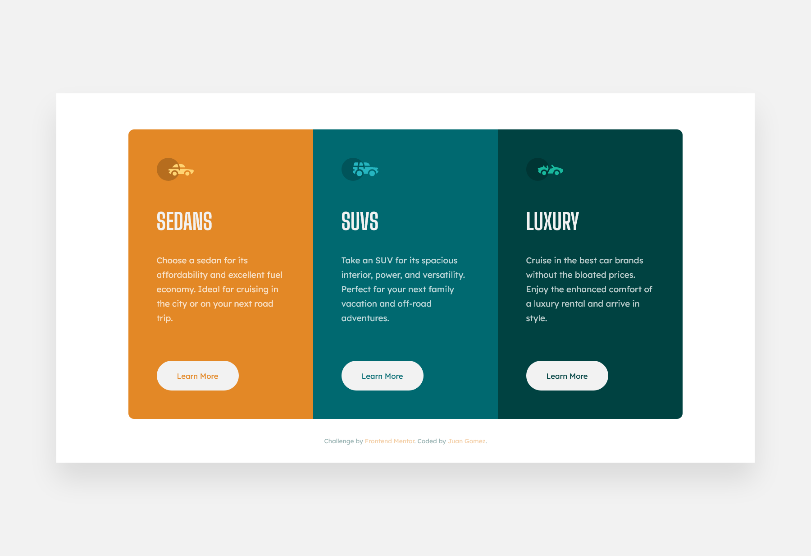

# Frontend Mentor - 3-column preview card component solution



This is a solution to the [3-column preview card component challenge on Frontend Mentor](https://www.frontendmentor.io/challenges/3column-preview-card-component-pH92eAR2-). Frontend Mentor challenges help you improve your coding skills by building realistic projects. 

## Table of contents

- [Overview](#overview)
  - [Screenshot](#screenshot)
  - [Links](#links)
- [My process](#my-process)
  - [Built with](#built-with)
  - [What I learned](#what-i-learned)
  - [Continued development](#continued-development)
  - [Useful resources](#useful-resources)
- [Author](#author)
- [Acknowledgments](#acknowledgments)

## Overview

This is my solution to the 3-column preview card component. I added a few extra
features to make the desktop version a little more pleasant.

### Screenshot


### Links

- Solution URL: [GitHub](https://github.com/newbpydev/05-3-column-preview-card-component-main)
- Live Site URL: [Live Site](https://cocky-poitras-2c8a95.netlify.app/)

## My process

### Built with

- Semantic HTML5 markup
- CSS custom properties
- Flexbox
- Grid

### What I learned

I have learned on this project that it is okay to take your time to play around
and experiment with your code to get the desired effects, I am really enjoying
the experience of working on my own discoveries.

```css
.art-learn-more {
  font-family: inherit;
  background-color: var(--neut-color-bg-headings-btns);
  border-style: none;
  padding: 1.8rem 3.6rem;
  border-radius: 5rem;
  cursor: pointer;
  transition: all .2s;
}

.section-prev-card .prev-col-art:nth-child(1) .art-learn-more {
  color: var(--prim-color-orange); 
}
.section-prev-card .prev-col-art:nth-child(1) .art-learn-more:hover {
  color: var(--neut-color-bg-headings-btns); 
  background-color: var(--prim-color-orange);
  box-shadow: inset 0rem 0rem 0rem .2rem var(--neut-color-bg-headings-btns);
}

.section-prev-card .prev-col-art:nth-child(2) .art-learn-more {
  color: var(--prim-color-dark-cyan); 
}
.section-prev-card .prev-col-art:nth-child(2) .art-learn-more:hover {
  color: var(--neut-color-bg-headings-btns); 
  background-color: var(--prim-color-dark-cyan);
  box-shadow: inset 0rem 0rem 0rem .2rem var(--neut-color-bg-headings-btns);
}
```

### Continued development

For future development, I will continue to use css selectors in different ways
to get the elements I want.

### Useful resources

- [MDN - text-decoration](https://developer.mozilla.org/en-US/docs/Web/CSS/text-decoration) - The text-decoration shorthand CSS property sets the appearance of decorative lines on text. It is a shorthand for text-decoration-line, text-decoration-color, text-decoration-style, and the newer text-decoration-thickness property.

## Author

- Website - [Juan Gomez](https://www.newbpydev.com)
- Frontend Mentor - [@newbpydev](https://www.frontendmentor.io/profile/newbpydev)
- Twitter - [@Newb_PyDev](https://twitter.com/Newb_PyDev)

## Acknowledgments

The code may not be perfect compared to my sensei @jonasschmedtman but I need
to thank him because he has shown me the ropes and now I am a confident web
designer.
